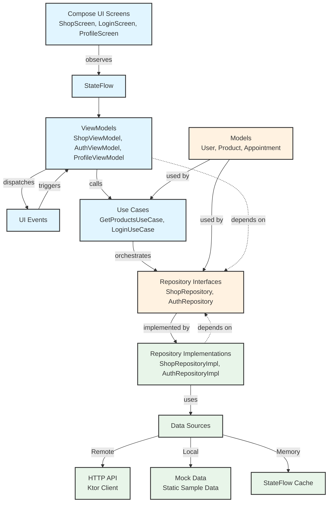
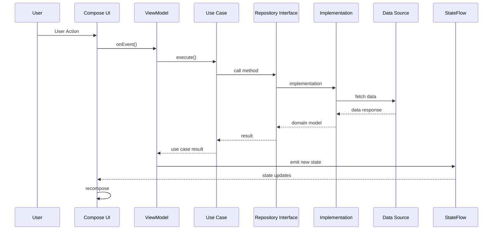
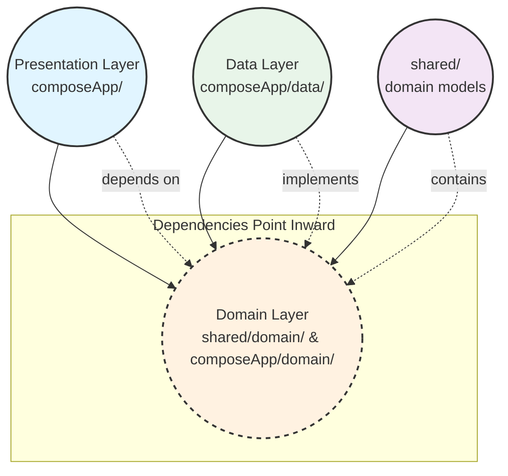

# Architecture Overview

This document describes the Clean Architecture implementation used in the COMP2300 multiplatform healthcare application. The codebase follows a three-layer architecture: **Presentation**, **Domain**, and **Data**.

Clean Architecture is employed to enforce separation of concerns, making the codebase more maintainable, testable, and adaptable to change by isolating business logic from framework dependencies.

---

## Architecture Layers

### 1. Domain Layer (Business Logic)

**Responsibility**: Contains pure business logic and defines contracts for data operations.

**Patterns**:
- **Models**: Kotlin data classes representing business entities (User, Product, Appointment, etc.)
- **Repository Interfaces**: Contracts that define what data operations are possible without specifying implementation
- **Use Cases**: Encapsulated business operations that orchestrate repository calls
- **Navigation Contract**: Type-safe screen definitions using sealed interfaces

**Key Principles**:
- Framework-independent (no Android/Compose dependencies)
- Pure Kotlin with coroutines for async operations
- Repository pattern abstracts data source details
- Models are immutable data classes with kotlinx.serialization

---

### 2. Data Layer (Repository Implementation)

**Responsibility**: Implements repository interfaces and manages data sources.

**Implementation Strategies**:
- **API Repositories**: For features requiring live data (e.g., Shop uses Ktor HTTP client)
- **Mock Repositories**: For development and testing with static sample data
- **In-Memory Repositories**: For session state and temporary data (e.g., authentication)

**Patterns**:
- **Data Transfer Objects**: Separate API models from domain models
- **Mappers**: Convert between DTOs and domain models
- **Repository Pattern**: Multiple implementations per interface enable source-swapping

**Key Principles**:
- Implementation lives separate from interface definitions
- Single Responsibility per data source type
- Easy to swap between mock and real APIs

---

### 3. Presentation Layer (UI)

**Responsibility**: Renders UI and handles user interactions.

**Patterns**:
- **ViewModels**: One per screen, extending `androidx.lifecycle.ViewModel`
- **StateFlow**: Reactive UI state management with immutable state objects
- **Unidirectional Data Flow**: Events flow up, state flows down
- **Sealed Interfaces**: Represent UI states (Loading, Success, Error)
- **Compose Multiplatform**: Shared UI code across Android, iOS, Desktop

**Navigation**:
- Type-safe navigation using Kotlin sealed interfaces
- Central Navigator ViewModel manages routing state
- Bottom navigation with 5 main tabs

**Key Principles**:
- ViewModels expose state as `StateFlow<UiState>`
- UI is a function of state (declarative)
- Business logic delegated to domain layer
- Navigation state in ViewModel, not hardcoded

---

## Layer Interaction Diagram

### Interaction Flow

1. **User Action** triggers UI event handlers
2. **ViewModel** receives event, may call **Use Case**
3. **Use Case** orchestrates business logic, calls **Repository Interface**
4. **Repository Implementation** fetches data from appropriate **Data Source**
5. **StateFlow** emits new state, **Compose UI** automatically recomposes

**Dependency Direction**: Presentation → Domain ← Data

---

## Data Flow

## Key Architectural Decisions

1. **Clean Architecture**: Layers are isolated - Domain has no dependencies, Presentation depends on Domain, Data depends on Domain

2. **Mock-First Development**: Repositories start with mock data, enabling rapid UI development before backend APIs exist

3. **Reactive State Management**: StateFlow provides automatic UI updates without manual subscriptions

4. **Type-Safe Navigation**: Sealed interfaces prevent invalid screen routes at compile time

5. **Multiplatform Shared Code**: UI and business logic shared across platforms, platform-specific code minimized

6. **Testing-Friendly Design**: Each layer can be tested independently with mocks

## Module Organization

- **`shared/`**: Pure Kotlin domain models and business logic
- **`composeApp/`**: Shared UI, ViewModels, and data implementations
- **`server/`**: Backend Ktor service (separate from client architecture)
- **`i18n/`**: Centralized string resources via Compose Multiplatform Resources

## Dependencies Between Layers

**Dependency Rules**:
- **No circular dependencies** - Each layer only references the layer inside it
- **Presentation does NOT depend on Data** - Only depends on Domain interfaces
- **Domain has NO external dependencies** - Pure Kotlin only

## Current Implementation Approach

The codebase uses a **mixed strategy** where:
- Some features use real API connections (Shop)
- Most features use mock data during development
- Authentication is handled in-memory

This enables parallel development where the UI is production-ready while backend APIs are still being developed.

---

*For development guidelines and workflows, see [AGENTS.md](./AGENTS.md).*
