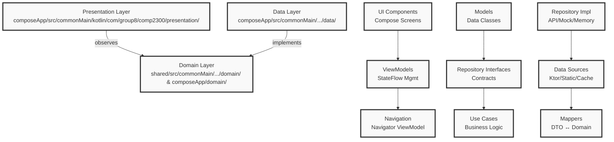
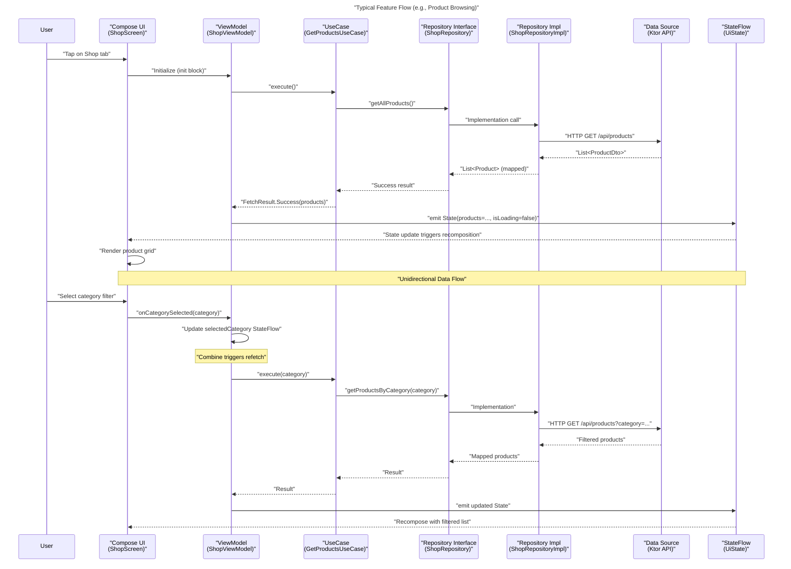
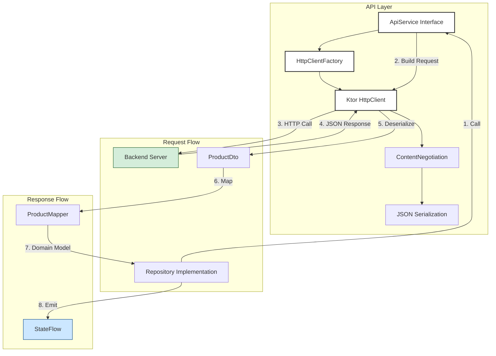
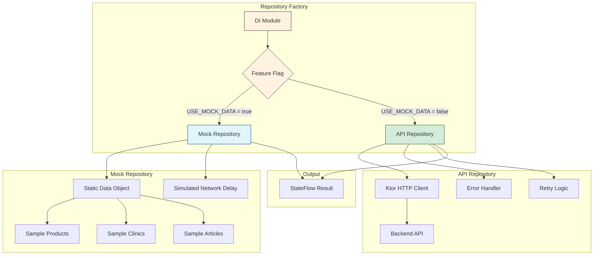
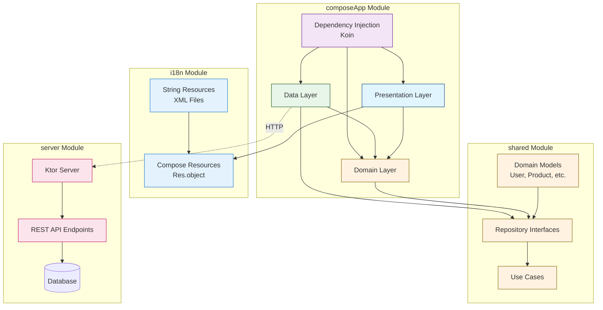
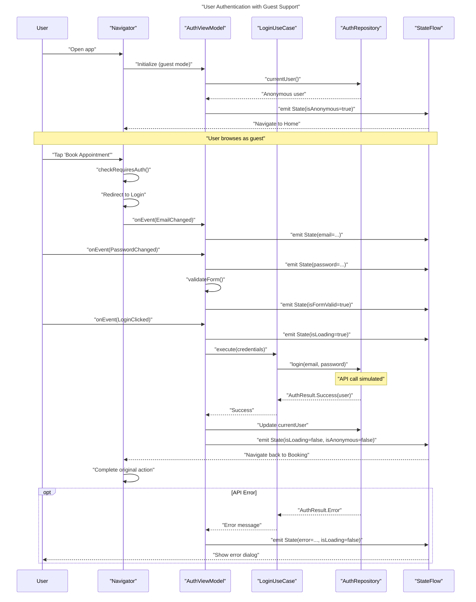
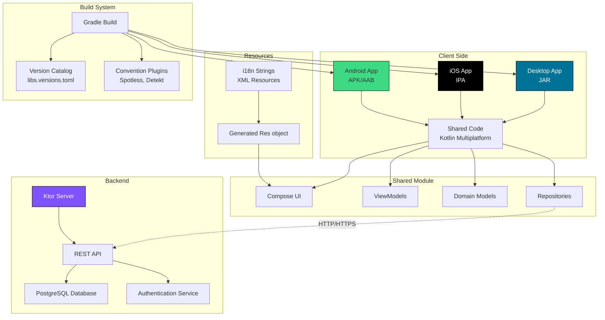

# Technical Design Document

**Project**: COMP2300 - Digital Sexual Healthcare Management Platform  
**Platform**: Kotlin Multiplatform (Android, iOS, Desktop)  
**Architecture**: Clean Architecture with MVVM Pattern  
**Last Updated**: December 2025

---

## Table of Contents

1. [Introduction](#1-introduction)
2. [System Requirements](#2-system-requirements)
3. [Architectural Overview](#3-architectural-overview)
4. [Detailed Design](#4-detailed-design)
5. [UML Diagrams](#5-uml-diagrams)
6. [Design Justifications](#6-design-justifications)
7. [Implementation Details](#7-implementation-details)
8. [Testing Strategy](#8-testing-strategy)
9. [Quality Assurance](#9-quality-assurance)
10. [Future Considerations](#10-future-considerations)

---

## 1. Introduction

### 1.1 Purpose

This document provides a comprehensive technical design for the COMP2300 healthcare application, detailing the architectural decisions, component interactions, and implementation strategies that enable a maintainable, scalable, and testable multiplatform solution.

### 1.2 Scope

This design covers:
- Client-side architecture (Android, iOS, Desktop)
- Clean Architecture implementation with three layers
- State management and reactive UI patterns
- Navigation and routing strategies
- Data persistence and API integration
- Testing and quality assurance approaches

### 1.3 Design Philosophy

Clean Architecture is employed to enforce separation of concerns, making the codebase more maintainable, testable, and adaptable to change by isolating business logic from framework dependencies.

---

## 2. System Requirements

### 2.1 Functional Requirements

| ID | Requirement | Design Response |
|----|-------------|-----------------|
| FR-01 | User authentication and profile management | Domain models (User, UserProfile) with AuthRepository interface; In-memory and API implementations |
| FR-02 | Browse and purchase healthcare products | ShopRepository with Product catalog; StateFlow for cart management; Ktor API integration |
| FR-03 | Book clinic appointments | ClinicRepository with Clinic/Doctor models; BookingViewModel with availability checking |
| FR-04 | Access educational content | EducationRepository with articles and videos; Quiz system with scoring |
| FR-05 | Track health metrics and lab results | MedicalRepository with LabResult/Medication models; Local history tracking |
| FR-06 | Set reminders for medications/tests | Reminder system with scheduled notifications; In-memory and persistent storage |
| FR-07 | Multiplatform support (Android, iOS, Desktop) | Kotlin Multiplatform with Compose Multiplatform UI; Platform expectations for native features |
| FR-08 | Offline capability for core features | Mock data repositories; Repository abstraction allows local-first implementation |

### 2.2 Non-Functional Requirements

| ID | Requirement | Design Response |
|----|-------------|-----------------|
| NFR-01 | **Performance**: App launch <3s, screen transitions <200ms | Lazy initialization; Compose optimization with remember keys; Efficient StateFlow updates |
| NFR-02 | **Maintainability**: Code structure supports long-term development | Clean Architecture with clear layer boundaries; Repository pattern; Comprehensive documentation |
| NFR-03 | **Testability**: >80% unit test coverage | Pure domain layer; Fake repositories; StateFlow test utilities; Dependency injection |
| NFR-04 | **Scalability**: Support 10,000+ concurrent users | Immutable data structures; Repository abstraction enables backend scaling; No global state |
| NFR-05 | **Security**: Secure authentication and data handling | Token-based auth (JWT pattern); Repository encapsulation; No sensitive data in UI state |
| NFR-06 | **Accessibility**: WCAG 2.1 AA compliance | Material 3 Expressive with built-in a11y; Semantic Compose modifiers; Screen reader support |
| NFR-07 | **Localization**: Support multiple languages | Centralized string resources in i18n module; Compose Multiplatform Resources |

### 2.3 Technical Constraints

- **Kotlin Multiplatform**: Must target Android, iOS, and JVM Desktop
- **Compose Multiplatform**: UI framework requirement
- **Material 3**: Design system requirement
- **Ktor**: HTTP client standard
- **No third-party ORMs**: Must use repository pattern for data access
- **Gradle Version Catalog**: Centralized dependency management

---

## 3. Architectural Overview

### 3.1 Layer Architecture



### 3.2 Component Interaction



---

## 4. Detailed Design

### 4.1 Presentation Layer Design

#### 4.1.1 ViewModel Architecture

```mermaid
classDiagram
    class "ViewModel" {
        <<interface>>
    }
    
    class "BaseViewModel~State, Event~" {
        -_state: MutableStateFlow~State~
        +state: StateFlow~State~
        #onEvent(event: Event)
    }
    
    class "ShopViewModel" {
        -repository: ShopRepository
        -selectedCategory: MutableStateFlow~ProductCategory~
        +onCategorySelected(category: ProductCategory)
        +onProductClicked(product: Product)
    }
    
    class "AuthViewModel" {
        -repository: AuthRepository
        +onEmailChanged(email: String)
        +onPasswordChanged(password: String)
        +onLoginClicked()
    }
    
    class "BookingViewModel" {
        -clinicRepository: ClinicRepository
        +onClinicSelected(clinic: Clinic)
        +onDateSelected(date: LocalDate)
        +onTimeSelected(time: LocalTime)
    }
    
    "ViewModel" <|-- "BaseViewModel~State, Event~"
    "BaseViewModel~State, Event~" <|-- "ShopViewModel"
    "BaseViewModel~State, Event~" <|-- "AuthViewModel"
    "BaseViewModel~State, Event~" <|-- "BookingViewModel"
    
    note for "BaseViewModel~State, Event~" "Generic base class\nfor typed state management"
```

#### 4.1.2 State Management Pattern

**State Class Structure**:
```
@Immutable
data class UiState(
    // Content
    val products: List<Product> = emptyList(),
    
    // Loading & Error
    val isLoading: Boolean = false,
    val error: StringResource? = null,
    
    // Form validation
    val emailError: StringResource? = null,
    val isFormValid: Boolean = false
)
```

**StateFlow Initialization**:
```kotlin
private val _state = MutableStateFlow(UiState())
val state: StateFlow<UiState> = _state.asStateFlow()
    .stateIn(
        scope = viewModelScope,
        started = SharingStarted.WhileSubscribed(5_000),
        initialValue = UiState()
    )
```

**Event Handling**:
```kotlin
sealed interface UiEvent {
    data class CategorySelected(val category: ProductCategory) : UiEvent
    data class ProductClicked(val productId: String) : UiEvent
    data object Retry : UiEvent
}

fun onEvent(event: UiEvent) {
    when (event) {
        is UiEvent.CategorySelected -> onCategorySelected(event.category)
        is UiEvent.ProductClicked -> onProductClicked(event.productId)
        UiEvent.Retry -> retry()
    }
}
```

#### 4.1.3 Navigation Design

```mermaid
graph TB
    %% Navigation Graph
    Start[Start] --> Onboarding
    Onboarding --> Login
    Onboarding --> Home
    
    subgraph "Main Tabs"
        Home --> ShopDetail[ProductDetail]
        Home --> Appointment
        Booking --> ClinicDetail
        Calendar --> AddReminder
        Education --> VideoDetail
        Education --> QuizScreen
        Profile --> Settings
    end
    
    %% Authentication Check
    ShopDetail --> Login
    Appointment --> Login
    AddReminder --> Login
    
    %% Styling
    classDef start fill:#d4edda,stroke:#155724
    classDef tab fill:#cce7ff,stroke:#004085
    classDef auth fill:#fff3cd,stroke:#856404
    
    class Start,Onboarding start
    class Home,Booking,Calendar,Education,Profile tab
    class Login auth
    
    note right of Login "Guest users redirected\nto login for restricted features"
```

**Navigator Implementation**:
```kotlin
class Navigator(
    private val navController: NavController,
    initialDestination: Screen = Screen.Onboarding
) {
    fun navigateTo(screen: Screen) {
        navController.navigate(screen)
    }
    
    fun navigateUp() {
        navController.navigateUp()
    }
    
    fun replaceAllWith(screen: Screen) {
        navController.navigate(screen) {
            popUpTo(navController.currentBackStackEntry?.destination?.id ?: return@navigate) {
                inclusive = true
            }
        }
    }
}
```

### 4.2 Domain Layer Design

#### 4.2.1 Model Hierarchy

```mermaid
classDiagram
    direction TB
    
    class "Entity" {
        <<interface>>
        +id: String
    }
    
    class "User" {
        id: String
        firstName: String
        lastName: String
        email: String
        dateOfBirth: LocalDate?
        gender: Gender?
        isAnonymous: Boolean
    }
    
    class "Appointment" {
        id: String
        userId: String
        clinicId: String
        date: LocalDate
        time: LocalTime
        status: AppointmentStatus
        notes: String?
    }
    
    class "Product" {
        id: String
        name: String
        price: Double
        category: ProductCategory
        insuranceCovered: Boolean
        imageUrl: String?
    }
    
    class "LabResult" {
        id: String
        userId: String
        testName: String
        result: String
        status: TestStatus
        date: LocalDate
    }
    
    class "Clinic" {
        id: String
        name: String
        address: String
        phone: String
        services: List~Service~
        operatingHours: Map~DayOfWeek, OpenHours~
    }
    
    "Entity" <|-- "User"
    "Entity" <|-- "Appointment"
    "Entity" <|-- "Product"
    "Entity" <|-- "LabResult"
    "Entity" <|-- "Clinic"
    
    note for "Entity" "Base interface for\nall domain entities"
```

#### 4.2.2 Repository Pattern

```mermaid
classDiagram
    direction TB
    
    class "Repository~T~" {
        <<interface>>
    }
    
    class "ShopRepository" {
        <<interface>>
        +getAllProducts(): Flow~List~Product~~
        +getProduct(id: String): Flow~Product~
        +getProductsByCategory(category: ProductCategory): Flow~List~Product~~
        +submitOrder(cart: Cart): Flow~OrderResult~
    }
    
    class "AuthRepository" {
        <<interface>>
        +currentUser(): Flow~User~
        +login(email: String, password: String): Flow~AuthResult~
        +logout(): Flow~Unit~
        +register(user: User): Flow~AuthResult~
    }
    
    class "MedicalRepository" {
        <<interface>>
        +getRecentLabResults(limit: Int): Flow~List~LabResult~~
        +getPrescriptions(): Flow~List~Prescription~~
        +getAppointments(): Flow~List~Appointment~~
    }
    
    class "ShopRepositoryImpl" {
        -apiService: ApiService
        +getAllProducts(): Flow~List~Product~~
    }
    
    class "FakeShopRepository" {
        -mockData: List~Product~
        +getAllProducts(): Flow~List~Product~~
    }
    
    class "AuthRepositoryImpl" {
        -currentUser: MutableStateFlow~User~
        +login(email: String, password: String): Flow~AuthResult~
    }
    
    "Repository~T~" <|-- "ShopRepository"
    "Repository~T~" <|-- "AuthRepository"
    "Repository~T~" <|-- "MedicalRepository"
    
    "ShopRepository" <|-- "ShopRepositoryImpl"
    "ShopRepository" <|-- "FakeShopRepository"
    "AuthRepository" <|-- "AuthRepositoryImpl"
    
    note for "ShopRepository" "Interface in Domain layer\nNo implementation details"
    note for "ShopRepositoryImpl" "Implementation in Data layer\nUses Ktor API"
    note for "FakeShopRepository" "Mock implementation\nFor development/ testing"
```

#### 4.2.3 Use Case Pattern

```mermaid
classDiagram
    direction TB
    
    class "UseCase~Input, Output~" {
        <<interface>>
        +execute(input: Input): Flow~Output~
    }
    
    class "GetProductsUseCase" {
        -repository: ShopRepository
        +execute(category: ProductCategory?): Flow~FetchResult~List~Product~~~~
    }
    
    class "LoginUseCase" {
        -authRepository: AuthRepository
        +execute(credentials: LoginCredentials): Flow~AuthResult~
    }
    
    class "GetRecentLabResultsUseCase" {
        -medicalRepository: MedicalRepository
        +execute(limit: Int = 10): Flow~FetchResult~List~LabResult~~~~
    }
    
    class "FetchResult~T~" {
        <<sealed>>
        +data class Success~T~(data: T)
        +data class Error(message: String, exception: Throwable?)
        +object Loading
    }
    
    "UseCase~Input, Output~" <|-- "GetProductsUseCase"
    "UseCase~Input, Output~" <|-- "LoginUseCase"
    "UseCase~Input, Output~" <|-- "GetRecentLabResultsUseCase"
    
    "GetProductsUseCase" --> "ShopRepository"
    "LoginUseCase" --> "AuthRepository"
    "GetRecentLabResultsUseCase" --> "MedicalRepository"
    
    "GetProductsUseCase" --> "FetchResult~T~"
    "GetRecentLabResultsUseCase" --> "FetchResult~T~"
    
    note for "UseCase~Input, Output~" "Encapsulates business logic\nSingle responsibility"
    note for "FetchResult~T~" "Sealed class for\nloading/error/success states"
```

### 4.3 Data Layer Design

#### 4.3.1 API Integration Architecture



**API Configuration**:
```kotlin
object HttpClientFactory {
    fun create(): HttpClient = HttpClient {
        install(ContentNegotiation) {
            json(Json {
                ignoreUnknownKeys = true
                isLenient = true
            })
        }
        defaultRequest {
            url("http://10.0.2.2:8080") // Android emulator
            contentType(ContentType.Application.Json)
        }
    }
}
```

#### 4.3.2 Data Source Strategy



**Implementation Strategy**:
- **Development**: Mock repositories with realistic sample data
- **Staging**: Partial API integration with feature flags
- **Production**: Full API integration with fallback to cached/mocked data

---

## 5. UML Diagrams

### 5.1 Component Diagram



### 5.2 Class Diagram - Complete Domain Model

```mermaid
classDiagram
    direction TB
    
    %% Core Entities
    class User {
        id: String
        firstName: String
        lastName: String
        email: String
        dateOfBirth: LocalDate?
        gender: Gender?
        sexualOrientation: SexualOrientation?
        isAnonymous: Boolean
        +getFullName(): String
    }
    
    class Product {
        id: String
        name: String
        price: Double
        category: ProductCategory
        insuranceCovered: Boolean
        imageUrl: String?
    }
    
    class Clinic {
        id: String
        name: String
        address: String
        phone: String
        services: List~Service~
        operatingHours: Map~DayOfWeek, OpenHours~
        coordinates: Coordinates?
    }
    
    class Appointment {
        id: String
        userId: String
        clinicId: String
        date: LocalDate
        time: LocalTime
        status: AppointmentStatus
        notes: String?
        doctorName: String?
    }
    
    class LabResult {
        id: String
        userId: String
        testName: String
        result: String
        status: TestStatus
        date: LocalDate
        referenceRange: String?
    }
    
    class ContentItem {
        id: String
        title: String
        content: String
        category: ContentCategory
        type: ContentType
        videoUrl: String?
        readTimeMinutes: Int
    }
    
    class Quiz {
        id: String
        title: String
        questions: List~Question~
        passingScore: Int
        category: ContentCategory
    }
    
    class Reminder {
        id: String
        userId: String
        title: String
        type: ReminderType
        dateTime: LocalDateTime
        frequency: Frequency
        isActive: Boolean
    }
    
    class Cart {
        userId: String
        items: List~CartItem~
        total: Double
        createdAt: LocalDateTime
    }
    
    class CartItem {
        productId: String
        quantity: Int
        priceAtAddition: Double
    }
    
    %% Relationships
    User "1" --> "many" Appointment : schedules
    User "1" --> "many" LabResult : has
    User "1" --> "many" Cart : creates
    User "1" --> "many" Reminder : sets
    
    Clinic "1" --> "many" Appointment : hosts
    Clinic "1" --> "many" Service : provides
    
    Product "many" --> "many" CartItem : contains
    Cart "1" --> "many" CartItem : contains
    
    Quiz "1" --> "many" Question : includes
    Question "1" --> "many" Answer : has
    
    ContentItem --> ContentCategory
    Quiz --> ContentCategory
    Reminder --> ReminderType
    Reminder --> Frequency
    
    %% Enumerations
    class Gender {
        <<enumeration>>
        MALE, FEMALE, NON_BINARY, PREFER_NOT_TO_SAY
    }
    
    class ProductCategory {
        <<enumeration>>
        ALL, TESTING, MEDICATION, PREVENTION
    }
    
    class ContentCategory {
        <<enumeration>>
        PUBERTY, RELATIONSHIPS, STI, IDENTITY, SEXUAL_HEALTH
    }
    
    class AppointmentStatus {
        <<enumeration>>
        PENDING, CONFIRMED, CANCELLED, COMPLETED
    }
    
    class TestStatus {
        <<enumeration>>
        POSITIVE, NEGATIVE, INCONCLUSIVE, PENDING
    }
    
    class ReminderType {
        <<enumeration>>
        MEDICATION, APPOINTMENT, TEST, CUSTOM
    }
    
    class Frequency {
        <<enumeration>>
        ONCE, DAILY, WEEKLY, MONTHLY
    }
    
    note for User "Core entity\nAnonymous or authenticated"
    note for Clinic "Geolocation-enabled\nfor map features"
    note for Cart "Session-based\nNo persistence yet"
```



### 5.3 Sequence Diagram - Authentication Flow



### 5.4 Deployment Diagram



---

## 6. Design Justifications

### 6.1 Why Clean Architecture?

**Decision**: Implement Clean Architecture with three distinct layers (Presentation, Domain, Data).

**Rationale**:
1. **Separation of Concerns**: Each layer has a single, well-defined responsibility
   - Presentation: UI rendering and user interaction
   - Domain: Business logic and enterprise rules
   - Data: Data access and external service integration

2. **Framework Independence**: Domain layer has zero external dependencies
   - Can be extracted and reused in other projects
   - Not tied to Android, iOS, or any UI framework
   - Business logic remains stable despite technology changes

3. **Testability**: Each layer can be tested in isolation
   - Domain: Unit tests with pure Kotlin
   - Presentation: ViewModel tests with fake repositories
   - Data: Repository tests with mock API clients

4. **Maintainability**: Clear boundaries reduce ripple effects
   - Changing database implementation doesn't affect UI
   - API contract changes are isolated to data layer
   - New features can be added without refactoring existing code

**Tradeoffs**:
- **Increased boilerplate**: More interfaces and abstraction layers
- **Learning curve**: Developers must understand architectural patterns
- **Initial setup complexity**: More files and directories

**Mitigation**: The long-term benefits outweigh the initial complexity, especially for a multiplatform project that needs to survive technology changes.

### 6.2 Why StateFlow Over LiveData?

**Decision**: Use Kotlin StateFlow instead of Android LiveData for reactive state management.

**Rationale**:
1. **Multiplatform Compatibility**: StateFlow works on all platforms (Android, iOS, Desktop)
   - LiveData is Android-only and would require platform-specific implementations
   - StateFlow is part of Kotlin coroutines, a shared dependency

2. **Better Integration**: Natural fit with Kotlin coroutines and Flow operators
   - `combine()`, `flatMapLatest()`, `debounce()` for complex state transformations
   - `shareIn()` and `stateIn()` for efficient state sharing

3. **Type Safety**: No nullability issues with initial values
   - `StateFlow<T>` always has a value
   - No need for `!!` operators or null checks

4. **Performance**: More efficient state updates
   - DistinctUntilChanged by default prevents unnecessary emissions
   - Thread-safe by design with atomic updates

**Tradeoffs**:
- **No automatic lifecycle awareness**: Required manual collection in Compose with `collectAsStateWithLifecycle()`
- **Learning curve**: Flow operators require understanding of reactive programming

**Mitigation**: Used `collectAsStateWithLifecycle()` for Android and `collectAsState()` for multiplatform with proper effect scoping.

### 6.3 Why Repository Pattern with Multiple Implementations?

**Decision**: Implement repository interfaces with multiple concrete implementations (API, Mock, In-Memory).

**Rationale**:
1. **Abstraction**: Repository interfaces hide data source details
   - UI doesn't know if data comes from API, database, or mock
   - Easy to swap implementations via dependency injection

2. **Development Velocity**: Mock repositories enable parallel development
   - Frontend team can build UI while backend API is being developed
   - No blocked work while waiting for API endpoints
   - Frontend defines API contract through DTOs

3. **Testing**: Fake repositories for isolated testing
   - Unit tests don't require network calls
   - Deterministic test data
   - Fast test execution

4. **Feature Flags**: Easy A/B testing and gradual rollouts
   - Switch between implementations at runtime
   - Gradual API migration from mock to real

**Tradeoffs**:
- **Code duplication**: Similar logic in mock and real implementations
- **Synchronization**: Mock data must stay in sync with API contract
- **DTO maintenance**: Separate models for API and domain

**Mitigation**:
- Strongly typed DTOs with kotlinx.serialization validation
- Automated contract tests between mock and API
- Mapper unit tests ensure conversion correctness

### 6.4 Why Koin Over Hilt/Dagger?

**Decision**: Choose Koin for dependency injection instead of Hilt (Dagger).

**Rationale**:
1. **Multiplatform Support**: Koin is Kotlin-first and works on all platforms
   - Hilt/Dagger are Android-only (JVM annotation processing)
   - Koin's DSL works natively in Kotlin Multiplatform

2. **Runtime Resolution**: No annotation processing or code generation
   - Faster build times
   - No kapt/ksp configuration issues
   - Easier to debug with clear stack traces

3. **Simplicity**: Koin modules are straightforward Kotlin code
   - Easy to understand and maintain
   - No magic - everything is explicitly defined
   - Works well with IDE refactoring tools

4. **Navigation3 Integration**: Seamless ViewModel scoping per route
   - Automatic ViewModel creation with route parameters
   - Proper lifecycle management
   - SavedStateHandle integration

**Tradeoffs**:
- **Runtime errors**: Mistakes in DI graph surface at runtime, not compile time
- **Less compile-time safety**: No automatic dependency validation
- **Smaller ecosystem**: Fewer third-party integrations than Dagger

**Mitigation**:
- Comprehensive application startup tests verify DI graph
- Integration tests for each screen's ViewModel
- Koin's checkModules() validation in test suite

### 6.5 Why Navigation3?

**Decision**: Use Jetpack Navigation 3.0 (Navigation Suite) instead of traditional Navigation Component.

**Rationale**:
1. **Type Safety**: Kotlin Serialization prevents invalid routes
   - Compile-time verification of route parameters
   - No string-based route definitions
   - Refactoring-safe navigation

2. **Multiplatform**: Built for Kotlin Multiplatform from the ground up
   - Supports Android, iOS (SwiftUI integration), and Desktop
   - Consistent API across platforms

3. **Adaptive Layouts**: Built-in support for List/Detail panes
   - Automatic responsive design for tablets and foldables
   - Single codebase for all screen sizes
   - Proper state restoration

4. **Integration**: Works seamlessly with Compose and Koin
   - Automatic ViewModel creation with SavedStateHandle
   - Navigation arguments passed as constructor parameters
   - Lifecycle-aware navigation

**Tradeoffs**:
- **Experimental status**: Navigation3 is still in alpha/beta
   - Potential API changes
   - Limited documentation
   - Smaller community support
- **Learning curve**: Different mental model than traditional navigation

**Mitigation**:
- Abstract navigation with custom Navigator class
- Minimal use of advanced features
- Comprehensive navigation tests
- Fallback to stable Navigation Component if needed

### 6.6 Why Mock-First Development?

**Decision**: Start with mock data repositories before implementing real API integrations.

**Rationale**:
1. **Rapid Prototyping**: UI/UX can be validated quickly
   - Immediate visual feedback
   - No backend dependency
   - Iterate on designs without API changes

2. **API Contract Definition**: Frontend defines expected data structure
   - DTOs serve as API specification
   - Backend team implements to match frontend expectations
   - Reduces integration friction

3. **Parallel Development**: Frontend and backend teams work simultaneously
   - No blocked waiting for API completion
   - Staggered feature development
   - Faster time-to-market

4. **Demo/Testing**: Always have stable demo version
   - Conference presentations
   - User testing sessions
   - Sales demonstrations

**Tradeoffs**:
- **Mock data maintenance**: Keeping mocks realistic and up-to-date
- **API drift**: Mocks may diverge from actual API
- **Over-reliance**: Team may delay real API integration

**Mitigation**:
- Automated contract tests mock vs API
- Scheduled API integration checkpoints
- Clear migration path from mock to real
- Shared DTO definitions between client and server

### 6.7 Why Compose Multiplatform Resources?

**Decision**: Centralize string resources in dedicated i18n module.

**Rationale**:
1. **Single Source of Truth**: All UI copy in one location
   - Easy to audit and update
   - Consistent terminology across app
   - Centralized localization workflow

2. **Compile-Time Safety**: Type-safe string references
   - IDE autocomplete support
   - Refactoring-safe
   - No runtime crashes from missing strings

3. **Multiplatform**: Works across all target platforms
   - Android string resources
   - iOS Localizable.strings
   - Desktop properties files
   - One definition, multiple outputs

4. **Developer Experience**: Easy to add and modify strings
   - No platform-specific XML/plist/property files
   - Consistent API: `stringResource(Res.string.key)`

**Tradeoffs**:
- **Build time**: Additional resource generation step
- **Limited tooling**: Fewer third-party localization tools
- **Learning curve**: New resource management system

**Mitigation**:
- Parallel build with resource generation
- IDE plugin for string resource management
- Clear documentation and examples

---

## 7. Implementation Details

### 7.1 Project Structure

```
comp2300/
├── composeApp/                          # Main application module
│   └── src/commonMain/kotlin/
│       └── com/group8/comp2300/
│           ├── App.kt                   # Application entry point
│           ├── di/                      # Dependency injection
│           │   ├── AppModule.kt         # Main DI module
│           │   ├── NavigationModule.kt  # Navigation bindings
│           │   └── PreviewModule.kt     # Fake data for previews
│           ├── domain/                  # Domain layer
│           │   ├── model/               # Domain models
│           │   │   ├── user/
│           │   │   ├── shop/
│           │   │   ├── medical/
│           │   │   ├── education/
│           │   │   └── Screen.kt        # Navigation screens
│           │   └── repository/          # Repository interfaces
│           ├── data/                    # Data layer
│           │   ├── repository/          # Repository implementations
│           │   ├── remote/              # API clients and DTOs
│           │   ├── mapper/              # DTO to domain mappers
│           │   └── local/               # Local data sources
│           └── presentation/            # Presentation layer
│               ├── navigation/           # Navigation logic
│               │   └── Navigator.kt
│               ├── ui/                   # UI components
│               │   ├── screens/         # Feature screens
│               │   └── components/      # Reusable components
│               └── util/                # Utilities
│                   └── DateFormatter.kt
├── shared/                              # Shared domain logic
│   └── src/commonMain/kotlin/
│       └── com/group8/comp2300/shared/
│           └── mock/                    # Mock data for development
│               ├── ShopData.kt
│               ├── EducationData.kt
│               └── BookingData.kt
├── i18n/                                # String resources
│   └── src/commonMain/composeResources/
│       └── values/
│           └── strings.xml
├── server/                              # Backend Ktor server
│   └── src/main/kotlin/
│       └── com/group8/comp2300/
│           ├── Application.kt
│           ├── routing/
│           └── models/
├── build-logic/                         # Convention plugins
└── gradle/libs.versions.toml           # Version catalog
```

### 7.2 Dependency Injection Configuration

**AppModule.kt**:
```kotlin
val appModule = module {
    // Repositories - Feature flag determines implementation
    single<ShopRepository> {
        if (AppConfig.USE_MOCK_DATA) {
            FakeShopRepository()
        } else {
            ShopRepositoryImpl(get())
        }
    }
    
    single<AuthRepository> { AuthRepositoryImpl() }
    single<MedicalRepository> { FakeMedicalRepository() }
    single<EducationRepository> { FakeEducationRepository() }
    single<ClinicRepository> { FakeClinicRepository() }
    
    // API
    single { HttpClientFactory.create() }
    single { ApiService(get()) }
    
    // Use Cases
    factory { GetProductsUseCase(get()) }
    factory { LoginUseCase(get()) }
    factory { GetRecentLabResultsUseCase(get()) }
    
    // ViewModels
    viewModel { ShopViewModel(get()) }
    viewModel { AuthViewModel(get()) }
    viewModel { BookingViewModel(get()) }
    viewModel { EducationViewModel(get()) }
    viewModel { MainViewModel(get(), get()) }
}
```

**NavigationModule.kt**:
```kotlin
val navigationModule = module {
    single { Navigator(get()) }
    
    // Screen-specific ViewModels with parameters
    viewModel { parameters ->
        ProductDetailViewModel(
            productId = parameters.get(),
            repository = get()
        )
    }
    
    viewModel { parameters ->
        ClinicDetailViewModel(
            clinicId = parameters.get(),
            clinicRepository = get(),
            appointmentRepository = get()
        )
    }
}
```

**PreviewModule.kt**:
```kotlin
// Separate module for Compose previews with fake data
val previewModule = module {
    single<ShopRepository> { FakeShopRepository() }
    single<AuthRepository> { FakeAuthRepository(isAuthenticated = false) }
    single<MedicalRepository> { FakeMedicalRepository() }
    single { FakeNavigator() }
}
```

### 7.3 State Management Implementation

**Generic ViewModel Base**:
```kotlin
abstract class BaseViewModel<State, Event>(
    initialState: State
) : ViewModel() {
    private val _state = MutableStateFlow(initialState)
    val state: StateFlow<State> = _state.asStateFlow()
    
    protected val currentState: State
        get() = _state.value
    
    protected fun setState(reducer: State.() -> State) {
        _state.update { it.reducer() }
    }
    
    abstract fun onEvent(event: Event)
}
```

**Concrete Implementation (ShopViewModel)**:
```kotlin
class ShopViewModel(
    private val getProductsUseCase: GetProductsUseCase
) : BaseViewModel<ShopState, ShopEvent>(ShopState()) {
    
    // Input flows
    private val selectedCategory = MutableStateFlow(ALL)
    private val searchQuery = MutableStateFlow("")
    private val refreshSignal = MutableSharedFlow<Unit>()
    
    // Derived state
    override val state: StateFlow<ShopState> = combine(
        getProductsFlow(),
        selectedCategory,
        searchQuery
    ) { productsResult, category, query ->
        ShopState(
            products = filterProducts(productsResult, category, query),
            selectedCategory = category,
            isLoading = productsResult is FetchResult.Loading,
            error = (productsResult as? FetchResult.Error)?.message
        )
    }.stateIn(
        scope = viewModelScope,
        started = SharingStarted.WhileSubscribed(5_000),
        initialValue = ShopState()
    )
    
    private fun getProductsFlow(): Flow<FetchResult<List<Product>>> =
        combine(refreshSignal.onStart { emit(Unit) }, selectedCategory) { _, category ->
            getProductsUseCase.execute(category)
        }.flatMapLatest { it }
    
    private fun filterProducts(
        result: FetchResult<List<Product>>,
        category: ProductCategory,
        query: String
    ): List<Product> = when (result) {
        is FetchResult.Success -> result.data
            .filter { category == ALL || it.category == category }
            .filter { query.isBlank() || it.name.contains(query, ignoreCase = true) }
        else -> emptyList()
    }
    
    override fun onEvent(event: ShopEvent) {
        when (event) {
            is ShopEvent.CategorySelected -> selectedCategory.value = event.category
            is ShopEvent.SearchQueryChanged -> searchQuery.value = event.query
            is ShopEvent.ProductClicked -> navigateToProduct(event.productId)
            ShopEvent.Refresh -> viewModelScope.launch { refreshSignal.emit(Unit) }
        }
    }
    
    private fun navigateToProduct(productId: String) {
        viewModelScope.launch {
            navigator.navigateTo(Screen.ProductDetail(productId))
        }
    }
}
```

### 7.4 API Client Implementation

**ApiService**:
```kotlin
interface ApiService {
    suspend fun getProducts(): List<ProductDto>
    suspend fun getProduct(id: String): ProductDto?
    suspend fun submitOrder(order: OrderDto): OrderResultDto
    
    companion object {
        operator fun invoke(client: HttpClient): ApiService = ApiServiceImpl(client)
    }
}

class ApiServiceImpl(private val client: HttpClient) : ApiService {
    override suspend fun getProducts(): List<ProductDto> =
        try {
            client.get("/api/products").body()
        } catch (e: Exception) {
            throw ApiException.NetworkError(e.message ?: "Network error")
        }
    
    override suspend fun getProduct(id: String): ProductDto? =
        try {
            client.get("/api/products/$id").body()
        } catch (e: ClientRequestException) {
            if (e.response.status == HttpStatusCode.NotFound) null
            else throw ApiException.UnknownError(e)
        }
}
```

**Error Handling**:
```kotlin
sealed class ApiException : Exception() {
    data class NetworkError(override val message: String) : ApiException()
    data class HttpError(val code: Int, override val message: String) : ApiException()
    data class UnknownError(val original: Throwable) : ApiException()
}

// Mapper with error handling
object ProductMapper {
    fun toDomain(dto: ProductDto): Result<Product, ApiException> = try {
        Result.Success(
            Product(
                id = dto.id,
                name = dto.name,
                price = dto.price.toDouble(), // May throw
                category = ProductCategory.valueOf(dto.category), // May throw
                insuranceCovered = dto.insuranceCovered
            )
        )
    } catch (e: Exception) {
        Result.Error(ApiException.UnknownError(e))
    }
}
```

### 7.5 Repository Pattern Implementation

**Repository Interface** (Domain Layer):
```kotlin
// In domain/repository/ShopRepository.kt
interface ShopRepository {
    suspend fun getAllProducts(): FetchResult<List<Product>>
    suspend fun getProduct(id: String): FetchResult<Product>
    suspend fun getProductsByCategory(category: ProductCategory): FetchResult<List<Product>>
}
```

**API Implementation** (Data Layer):
```kotlin
class ShopRepositoryImpl(
    private val apiService: ApiService,
    private val productMapper: ProductMapper
) : ShopRepository {
    
    override suspend fun getAllProducts(): FetchResult<List<Product>> =
        withContext(Dispatchers.IO) {
            try {
                val dtos = apiService.getProducts()
                val products = dtos.map { productMapper.toDomain(it) }
                FetchResult.Success(products)
            } catch (e: ApiException.NetworkError) {
                FetchResult.Error("Network error. Please check your connection.", e)
            } catch (e: ApiException) {
                FetchResult.Error("Failed to load products. Please try again.", e)
            }
        }
    
    override suspend fun getProduct(id: String): FetchResult<Product> =
        withContext(Dispatchers.IO) {
            try {
                val dto = apiService.getProduct(id)
                if (dto != null) {
                    FetchResult.Success(productMapper.toDomain(dto))
                } else {
                    FetchResult.Error("Product not found")
                }
            } catch (e: Exception) {
                FetchResult.Error("Failed to load product", e)
            }
        }
}
```

**Mock Implementation**:
```kotlin
class FakeShopRepository : ShopRepository {
    private val mockProducts = ShopData.products
    private val delayMs = 500L // Simulate network delay
    
    override suspend fun getAllProducts(): FetchResult<List<Product>> {
        delay(delayMs)
        return FetchResult.Success(mockProducts)
    }
    
    override suspend fun getProduct(id: String): FetchResult<Product> {
        delay(delayMs)
        val product = mockProducts.find { it.id == id }
        return if (product != null) {
            FetchResult.Success(product)
        } else {
            FetchResult.Error("Product not found")
        }
    }
    
    override suspend fun getProductsByCategory(category: ProductCategory): FetchResult<List<Product>> {
        delay(delayMs)
        val filtered = mockProducts.filter { it.category == category }
        return FetchResult.Success(filtered)
    }
}
```

### 7.6 Navigation Implementation

**Navigator**:
```kotlin
class Navigator(
    private val navController: NavController,
    private val authRepository: AuthRepository
) {
    // Type-safe navigation
    fun navigateTo(screen: Screen) {
        viewModelScope.launch {
            // Check authentication for protected routes
            if (screen.requiresAuth && authRepository.currentUser().first().isAnonymous) {
                navController.navigate(Screen.Login)
                return@launch
            }
            navController.navigate(screen)
        }
    }
    
    fun navigateUp() {
        navController.navigateUp()
    }
    
    fun popBackStack(route: String, inclusive: Boolean = false) {
        navController.popBackStack(route, inclusive)
    }
    
    fun replaceAllWith(screen: Screen) {
        navController.navigate(screen) {
            popUpTo(navController.graph.startDestinationId) {
                inclusive = true
            }
            launchSingleTop = true
        }
    }
    
    // Backstack management
    fun saveState(outState: Bundle) {
        // Save navigation state
    }
    
    fun restoreState(savedState: Bundle?) {
        // Restore navigation state
    }
}
```

**Screen Definitions**:
```kotlin
@Serializable
sealed interface Screen : NavKey {
    val requiresAuth: Boolean
    
    @Serializable
    data object Onboarding : Screen {
        override val requiresAuth = false
    }
    
    @Serializable
    data object Login : Screen {
        override val requiresAuth = false
    }
    
    @Serializable
    data object Home : Screen {
        override val requiresAuth = false
    }
    
    @Serializable
    data class ProductDetail(val productId: String) : Screen {
        override val requiresAuth = false
    }
    
    @Serializable
    data class ClinicDetail(val clinicId: String) : Screen {
        override val requiresAuth = true
    }
    
    @Serializable
    data object Appointment : Screen {
        override val requiresAuth = true
    }
}
```

---

## 8. Testing Strategy

### 8.1 Testing Pyramid

```
          UI Tests (Compose)
                ↑
        Integration Tests
                ↑
        Unit Tests (Domain)
                ↑
        Static Analysis (Detekt, Spotless)
```

### 8.2 Test Types and Coverage

| Test Type | Target Coverage | Framework | Files |
|-----------|-----------------|-----------|-------|
| **Unit** | 90%+ Domain Layer | JUnit, Kotest | Domain models, use cases, mappers |
| **Unit** | 80%+ ViewModels | JUnit, Turbine | ViewModel state emissions |
| **Integration** | 70%+ Repositories | Ktor MockEngine | Repository implementations |
| **UI** | Critical user flows | Compose UI Test | Login flow, purchase flow |

### 8.3 Unit Test Examples

**Domain Model Test**:
```kotlin
class UserTest {
    @Test
    fun `getFullName returns concatenated name`() {
        val user = User(
            id = "1",
            firstName = "John",
            lastName = "Doe",
            email = "john@example.com"
        )
        
        assertEquals("John Doe", user.getFullName())
    }
    
    @Test
    fun `isAnonymous defaults to false for authenticated users`() {
        val user = User(
            id = "1",
            firstName = "John",
            lastName = "Doe",
            email = "john@example.com",
            isAnonymous = false
        )
        
        assertFalse(user.isAnonymous)
    }
}
```

**Use Case Test**:
```kotlin
class GetProductsUseCaseTest {
    
    private lateinit var fakeRepository: FakeShopRepository
    private lateinit var useCase: GetProductsUseCase
    
    @Before
    fun setup() {
        fakeRepository = FakeShopRepository()
        useCase = GetProductsUseCase(fakeRepository)
    }
    
    @Test
    fun `execute returns success with products`() = runTest {
        val result = useCase.execute().first()
        
        assertTrue(result is FetchResult.Success)
        assertEquals(10, (result as FetchResult.Success).data.size)
    }
    
    @Test
    fun `execute with category filters correctly`() = runTest {
        val result = useCase.execute(MEDICATION).first()
        
        assertTrue(result is FetchResult.Success)
        val products = (result as FetchResult.Success).data
        assertTrue(products.all { it.category == MEDICATION })
    }
}
```

**ViewModel Test**:
```kotlin
class ShopViewModelTest {
    
    private lateinit var viewModel: ShopViewModel
    private lateinit var fakeRepository: FakeShopRepository
    private lateinit var testDispatcher: TestDispatcher
    
    @Before
    fun setup() {
        testDispatcher = UnconfinedTestDispatcher()
        Dispatchers.setMain(testDispatcher)
        fakeRepository = FakeShopRepository()
        viewModel = ShopViewModel(GetProductsUseCase(fakeRepository))
    }
    
    @After
    fun teardown() {
        Dispatchers.resetMain()
    }
    
    @Test
    fun `initial state is loading`() = runTest {
        assertTrue(viewModel.state.value.isLoading)
        assertTrue(viewModel.state.value.products.isEmpty())
    }
    
    @Test
    fun `state updates to success after loading`() = runTest {
        // Advance time to complete loading
        advanceUntilIdle()
        
        val state = viewModel.state.value
        assertFalse(state.isLoading)
        assertNull(state.error)
        assertEquals(10, state.products.size)
    }
    
    @Test
    fun `category selection updates state`() = runTest {
        advanceUntilIdle()
        
        viewModel.onEvent(ShopEvent.CategorySelected(MEDICATION))
        advanceUntilIdle()
        
        val state = viewModel.state.value
        assertEquals(MEDICATION, state.selectedCategory)
        assertTrue(state.products.all { it.category == MEDICATION })
    }
}
```

**Repository Integration Test**:
```kotlin
class ShopRepositoryImplTest {
    
    private lateinit var mockEngine: MockEngine
    private lateinit var httpClient: HttpClient
    private lateinit var apiService: ApiService
    private lateinit var repository: ShopRepository
    
    @Before
    fun setup() {
        mockEngine = MockEngine { request ->
            when (request.url.fullPath) {
                "/api/products" -> respond(
                    content = """[
                        {"id":"1","name":"Test Product","price":"9.99","category":"TESTING","insuranceCovered":true}
                    ]""",
                    status = HttpStatusCode.OK,
                    headers = headersOf("Content-Type" to listOf("application/json"))
                )
                else -> respondError(HttpStatusCode.NotFound)
            }
        }
        
        httpClient = HttpClient(mockEngine) {
            install(ContentNegotiation) { json() }
        }
        
        apiService = ApiService(httpClient)
        repository = ShopRepositoryImpl(apiService, ProductMapper)
    }
    
    @Test
    fun `getAllProducts returns mapped domain objects`() = runTest {
        val result = repository.getAllProducts()
        
        assertTrue(result is FetchResult.Success)
        val products = (result as FetchResult.Success).data
        assertEquals(1, products.size)
        assertEquals("Test Product", products.first().name)
        assertEquals(TESTING, products.first().category)
    }
    
    @Test
    fun `getAllProducts handles network errors`() = runTest {
        mockEngine.config {
            respondError(HttpStatusCode.InternalServerError)
        }
        
        val result = repository.getAllProducts()
        
        assertTrue(result is FetchResult.Error)
    }
}
```

### 8.4 UI Test Example

```kotlin
class ShopScreenTest {
    
    @get:Rule
    val composeTestRule = createComposeRule()
    
    @Test
    fun `product list displays correctly`() {
        composeTestRule.setContent {
            AppTheme {
                KoinApplicationPreview(application = { modules(previewModule) }) {
                    ShopScreen(onProductClick = {})
                }
            }
        }
        
        // Verify loading state
        composeTestRule.onNodeWithTag("loading_indicator").assertExists()
        
        // Wait for content to load
        composeTestRule.waitUntil(timeoutMillis = 5000) {
            composeTestRule.onAllNodesWithTag("product_card").fetchSemanticsNodes().isNotEmpty()
        }
        
        // Verify products displayed
        composeTestRule.onAllNodesWithTag("product_card").assertCountEquals(10)
        
        // Verify first product name
        composeTestRule.onNodeWithText("Condoms (12 pack)").assertExists()
    }
    
    @Test
    fun `category filter updates product list`() {
        composeTestRule.setContent {
            AppTheme {
                KoinApplicationPreview(application = { modules(previewModule) }) {
                    ShopScreen(onProductClick = {})
                }
            }
        }
        
        // Wait for initial load
        composeTestRule.waitUntil(timeoutMillis = 5000) {
            composeTestRule.onAllNodesWithTag("product_card").fetchSemanticsNodes().isNotEmpty()
        }
        
        // Tap medication category filter
        composeTestRule.onNodeWithTag("filter_medication").performClick()
        
        // Verify filtered results
        composeTestRule.waitUntil(timeoutMillis = 2000) {
            composeTestRule.onAllNodesWithTag("product_card").fetchSemanticsNodes().size < 10
        }
        
        // Verify all displayed products are medication category
        composeTestRule.onAllNodesWithTag("product_category_label").assertAll(
            hasText("MEDICATION")
        )
    }
}
```

---

## 9. Quality Assurance

### 9.1 Code Quality Tools

**Spotless Configuration** (`.editorconfig` + `build.gradle.kts`):
```kotlin
// In build-logic/convention/build.gradle.kts
spotless {
    kotlin {
        target("**/*.kt")
        ktlint().editorConfigOverride(
            mapOf(
                "insert_final_newline" to "true",
                "end_of_line" to "lf",
                "charset" to "utf-8"
            )
        )
        trimTrailingWhitespace()
        indentWithSpaces(4)
    }
}
```

**Usage**:
```bash
./gradlew spotlessApply    # Auto-format code
./gradlew spotlessCheck    # Check formatting (CI)
```

**Detekt Configuration** (`config/detekt/detekt.yml`):
```yaml
# Custom rules for the project
style:
  MagicNumber:
    active: true
    excludes: ['**/test/**', '**/Mock*.kt']
  
complexity:
  LongParameterList:
    active: true
    functionThreshold: 6
    
compose:
  ReusedModifierInstance:
    active: true
  ModifierWithoutDefault:
    active: true
```

**Usage**:
```bash
./gradlew detekt            # Run static analysis
./gradlew detektBaseline    # Create/Update baseline for existing issues
```

### 9.2 Pre-Commit Hooks

**`.git/hooks/pre-commit`**:
```bash
#!/bin/bash
echo "Running pre-commit checks..."

# Run spotless check
./gradlew spotlessCheck
if [ $? -ne 0 ]; then
    echo "❌ Code formatting issues found. Run './gradlew spotlessApply' to fix."
    exit 1
fi

# Run detekt
./gradlew detekt
if [ $? -ne 0 ]; then
    echo "❌ Code quality issues found. Check detekt report."
    exit 1
fi

# Run unit tests
./gradlew test
if [ $? -ne 0 ]; then
    echo "❌ Tests failed. Fix before committing."
    exit 1
fi

echo "✅ All checks passed!"
exit 0
```

### 9.3 Continuous Integration

**GitHub Actions Workflow** (`.github/workflows/ci.yml`):
```yaml
name: CI

on:
  push:
    branches: [ main, develop ]
  pull_request:
    branches: [ main ]

jobs:
  build:
    runs-on: ubuntu-latest
    
    steps:
      - uses: actions/checkout@v3
      
      - name: Set up JDK 17
        uses: actions/setup-java@v3
        with:
          java-version: '17'
          distribution: 'temurin'
      
      - name: Setup Gradle
        uses: gradle/gradle-build-action@v2
      
      - name: Check formatting
        run: ./gradlew spotlessCheck
      
      - name: Run static analysis
        run: ./gradlew detekt
      
      - name: Run unit tests
        run: ./gradlew test
      
      - name: Build Android
        run: ./gradlew :composeApp:assembleDebug
      
      - name: Build Desktop
        run: ./gradlew :composeApp:run --dry-run
      
      - name: Upload reports
        uses: actions/upload-artifact@v3
        if: always()
        with:
          name: reports
          path: |
            **/build/reports/
            **/build/test-results/
```

### 9.4 Code Review Checklist

**Required Checks**:
- [ ] All tests pass (`./gradlew test`)
- [ ] Code formatted (`./gradlew spotlessApply`)
- [ ] No new Detekt issues (`./gradlew detekt`)
- [ ] Compose previews added for new UI components
- [ ] String resources used (not hardcoded strings)
- [ ] ViewModel has StateFlow with immutable state
- [ ] Navigation uses type-safe Screen definitions
- [ ] Repository pattern followed (interface + implementation)
- [ ] Error handling with FetchResult sealed class
- [ ] Documentation added for public APIs

**Architecture Checks**:
- [ ] Domain layer has no external dependencies
- [ ] Presentation layer depends only on Domain
- [ ] Data layer implements Domain interfaces
- [ ] No circular dependencies between modules
- [ ] Dependency injection properly configured
- [ ] Navigation uses Navigator abstraction

---

## 10. Future Considerations

### 10.1 Planned Enhancements

**Near-term (Next 3 months)**:
1. **Real API Integration**: Migrate from mock to backend APIs
   - Add authentication token management
   - Implement caching strategy (Room/SQLDelight)
   - Add offline-first data sync

2. **Enhanced State Management**: Introduce state machine library
   - Use `kstatemachine` or `compose-state-machine` for complex flows
   - Better form state management with validation rules

3. **Testing Infrastructure**: Expand test coverage
   - Add screenshot testing with Paparazzi
   - Add performance benchmarks
   - Add accessibility testing

**Medium-term (3-6 months)**:
1. **Backend Enhancement**: Comprehensive server implementation
   - Complete Ktor server with all endpoints
   - Database integration (PostgreSQL)
   - Authentication service (JWT)
   - Push notification service

2. **Platform-Specific Features**:
   - Android: Widgets, shortcuts, biometrics
   - iOS: WidgetKit, Face ID, HealthKit integration
   - Desktop: System tray, file export, offline mode

3. **Analytics and Monitoring**:
   - Firebase Analytics / Mixpanel
   - Crashlytics integration
   - Performance monitoring
   - User behavior tracking

**Long-term (6+ months)**:
1. **Advanced Features**:
   - Telehealth integration (video consultations)
   - AI-powered symptom checker
   - Medication interaction checker
   - Integration with pharmacy APIs

2. **Scalability**:
   - Caching strategy with Redis
   - Database sharding for user data
   - CDN for media content
   - Microservices architecture

### 10.2 Technical Debt and Refactoring

**Current Technical Debt**:
1. **Mock Data Maintenance**: Keep mock data in sync with API contract
   - **Mitigation**: Automated contract tests
   - **Timeline**: Address as APIs are implemented

2. **Error Handling**: Inconsistent error states across screens
   - **Mitigation**: Standardize on FetchResult sealed class
   - **Timeline**: Refactor during screen updates

3. **No Offline Caching**: All data is network-only or mock
   - **Mitigation**: Add local database (SQLDelight)
   - **Timeline**: Next quarter

4. **No Analytics**: No user behavior tracking
   - **Mitigation**: Add analytics abstraction
   - **Timeline**: Next sprint

**Refactoring Priorities**:
1. Extract common UI patterns into reusable components
2. Standardize error messages across screens
3. Add comprehensive loading states
4. Implement proper pagination for lists
5. Add pull-to-refresh for data screens

### 10.3 Migration Strategies

**From Mock to Real API**:
```kotlin
// Phase 1: Current state - all mocks
single<ShopRepository> { FakeShopRepository() }

// Phase 2: Feature flag
single<ShopRepository> {
    if (featureFlags.useRealApi) {
        ShopRepositoryImpl(get())
    } else {
        FakeShopRepository()
    }
}

// Phase 3: Full API with fallback
single<ShopRepository> {
    ShopRepositoryImpl(
        get(),
        fallback = FakeShopRepository(),
        cache = LocalShopDataSource(get())
    )
}
```

**Adding Offline Support**:
```kotlin
// Current implementation (network only)
class ShopRepositoryImpl(private val api: ApiService) : ShopRepository

// Future implementation (cache + network)
class ShopRepositoryImpl(
    private val api: ApiService,
    private val cache: ProductCache
) : ShopRepository {
    override suspend fun getAllProducts(): Flow<List<Product>> = flow {
        // Emit cached data first
        cache.getAll()?.let { emit(it) }
        
        // Fetch fresh data from API
        val network = api.getProducts().body()
        val products = network.map { ProductMapper.toDomain(it) }
        
        // Save to cache
        cache.saveAll(products)
        
        // Emit fresh data
        emit(products)
    }
}
```

### 10.4 Performance Optimization Roadmap

**Current Bottlenecks**:
1. All products loaded at once (no pagination)
2. No image caching or compression
3. No database, all data in memory
4. Synchronous blocking operations on main thread

**Optimization Plan**:

| Priority | Issue | Solution | Timeline |
|----------|-------|----------|----------|
| P0 | Product list performance | Add pagination with `PagingSource` | Sprint 2 |
| P0 | Image loading | Add Coil Multiplatform with caching | Sprint 2 |
| P1 | Database persistence | Add SQLDelight for local storage | Sprint 3 |
| P1 | Background operations | Use `kotlinx-coroutines` properly | Sprint 3 |
| P2 | Startup time | Lazy initialization of repositories | Sprint 4 |
| P2 | Memory leaks | Add LeakCanary for Android | Sprint 4 |
| P3 | Network optimization | Add request batching and compression | Q2 |

**Performance Targets**:
- App startup: <2 seconds (currently ~3s)
- Screen transitions: <150ms (currently ~200-300ms)
- List scrolling: 60 FPS (currently 45-55 FPS with large lists)
- Memory usage: <100MB average (currently ~120MB)

### 10.5 Security Considerations

**Current State**: Basic in-memory authentication (no real security)

**Security Roadmap**:
```
Phase 1: JWT Authentication
- Token storage in EncryptedSharedPreferences (Android)
- Keychain access (iOS)
- Secure storage abstraction

Phase 2: API Security
- HTTPS enforcement
- Certificate pinning
- Request/response encryption

Phase 3: Data Protection
- Local database encryption (SQLCipher)
- Sensitive data masking
- Biometric authentication for sensitive actions

Phase 4: Compliance
- HIPAA compliance measures
- GDPR data handling
- Audit logging
```

---

## Appendix

### A. File Path Reference

**Core Application**:
- `composeApp/src/commonMain/kotlin/com/group8/comp2300/App.kt` - Application entry
- `composeApp/src/commonMain/kotlin/com/group8/comp2300/di/AppModule.kt` - DI configuration
- `composeApp/src/commonMain/kotlin/com/group8/comp2300/presentation/navigation/Navigator.kt` - Navigation

**Domain Layer**:
- `shared/src/commonMain/kotlin/com/group8/comp2300/domain/model/user/User.kt`
- `shared/src/commonMain/kotlin/com/group8/comp2300/domain/model/shop/Product.kt`
- `composeApp/src/commonMain/kotlin/com/group8/comp2300/domain/repository/ShopRepository.kt`

**Data Layer**:
- `composeApp/src/commonMain/kotlin/com/group8/comp2300/data/repository/ShopRepositoryImpl.kt`
- `composeApp/src/commonMain/kotlin/com/group8/comp2300/data/remote/ApiService.kt`
- `composeApp/src/commonMain/kotlin/com/group8/comp2300/data/mapper/ProductMapper.kt`
- `shared/src/commonMain/kotlin/com/group8/comp2300/mock/ShopData.kt`

**Presentation Layer**:
- `composeApp/src/commonMain/kotlin/com/group8/comp2300/presentation/ui/screens/shop/ShopScreen.kt`
- `composeApp/src/commonMain/kotlin/com/group8/comp2300/presentation/ui/screens/shop/ShopViewModel.kt`
- `composeApp/src/commonMain/kotlin/com/group8/comp2300/presentation/ui/components/ProductCard.kt`

**Resources**:
- `i18n/src/commonMain/composeResources/values/strings.xml`

### B. Build Commands

```bash
# Development
./gradle :composeApp:run                            # Run desktop app
./gradle :composeApp:installDebug                   # Install to Android device
./gradle :server:run                                # Run backend server

# Code Quality
./gradlew spotlessApply                             # Format code
./gradlew detekt                                    # Run static analysis
./gradlew test                                      # Run all tests

# Build
./gradlew build                                     # Build all modules
./gradlew :composeApp:assembleRelease              # Build Android release

# Utility
./gradlew dependencyUpdates                         # Check for dependency updates
./gradlew clean                                     # Clean build artifacts
```

### C. Dependency Versions

**Key Dependencies** (from `gradle/libs.versions.toml`):
- Kotlin: 2.0.0
- Compose Multiplatform: 1.6.11
- Ktor: 2.3.11
- Koin: 3.6.0
- Navigation3: 2.8.0-alpha08
- kotlinx-serialization: 1.6.3
- kotlinx-coroutines: 1.8.1

---

## Document Revisions

| Version | Date | Author | Changes |
|---------|------|--------|---------|
| 1.0 | 2025-12 | AI Agent | Initial technical design document |
| 1.1 | TBD | Development Team | Add API contract details |
| 1.2 | TBD | Development Team | Add performance benchmarks |

---

*For development workflows and coding standards, see [AGENTS.md](./AGENTS.md).*
*For high-level architecture overview, see [ARCHITECTURE.md](./ARCHITECTURE.md).*
