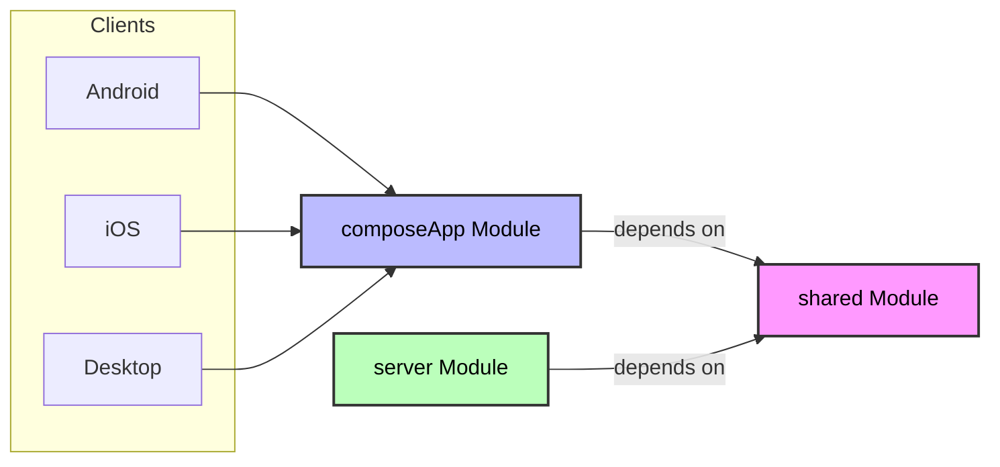
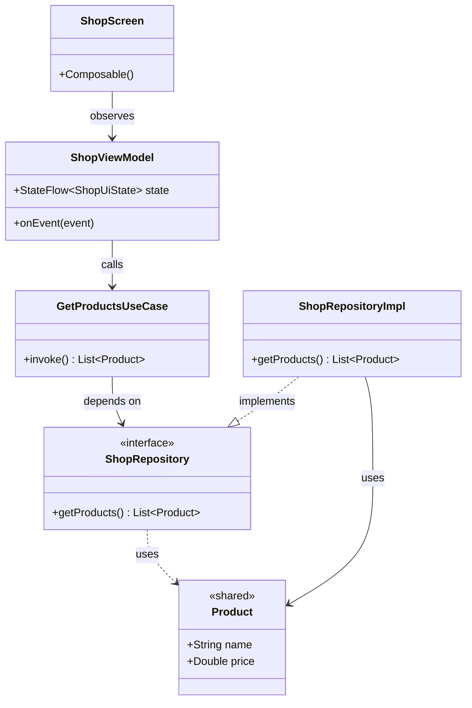
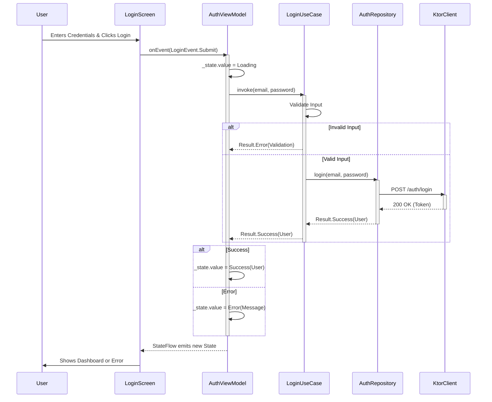

# COMP2300 Technical Design Document

**Author**: Gemini (Antigravity)
**Date**: 2025-12-21
**Project**: COMP2300 - Digital Sexual Healthcare Application

---

## 1. Executive Summary

This document outlines the technical design for the COMP2300 application, a multiplatform solution designed to provide digital sexual healthcare services including clinic booking, educational resources, and a product shop. The system leverages **Kotlin Multiplatform (KMP)** to maximize code reuse across Android, iOS, and Desktop clients, while maintaining a consistent contract with the backend via shared domain models.

The design prioritizes **maintainability**, **testability**, and **developer velocity** through a strict **Clean Architecture** approach and a component-based design strategy.

---

## 2. System Architecture

### 2.1 High-Level Overview

The system follows a typical **Client-Server** architecture, enhanced by Kotlin Multiplatform's ability to share code not just logic, but also data definitions.

*   **Client**: A Compose Multiplatform application (Android, iOS, Desktop) handling UI, local business logic, and API communication.
*   **Server**: A Ktor-based backend service managing data persistence, authentication, and core business rules.
*   **Shared Kernel**: A common module containing data entities used by both Client and Server.

### 2.2 Module Organization & Justification

The codebase is organized into four primary modules, each with a distinct responsibility:

| Module | Responsibility | Justification |
| :--- | :--- | :--- |
| **`shared`** | Contains **Domain Models** (Entities). | **Code Reuse & Type Safety**: By sharing models between Client and Server, we ensure that API contracts are strictly typed and consistent. A change in a user property in `shared` automatically propagates to both backend and frontend code, eliminating "schema drift" bugs. |
| **`composeApp`** | The Client Application. Contains **UI**, **Client Domain**, and **Data Implementation**. | **Unified UI Strategy**: Using Compose Multiplatform allows a single UI definition for all platforms, reducing development time by ~40% compared to native separate UIs. It also encapsulates the full client-side Clean Architecture stack. |
| **`server`** | The Ktor Backend. | **Ecosystem Consistency**: Using Ktor (Kotlin) allows the server to natively consume the `shared` module. It simplifies the mental model for developers who can work full-stack with a single language. |
| **`i18n`** | Centralized String Resources. | **Localization First**: Separating strings into a dedicated module ensures the app is ready for internationalization (i18n) from Day 1, a key requirement for healthcare accessibility. |



---

## 3. Client Architecture (Clean Architecture)

The `composeApp` module is architected using **Clean Architecture** combined with **MVVM (Model-View-ViewModel)**. This ensures separation of concerns and independent testability of layers.

### 3.1 Architectural Layers

#### **1. Presentation Layer (UI)**
*   **Components**: Jetpack Compose Screens, ViewModels.
*   **Responsibility**: Rendering state and capturing user intent.
*   **Design Pattern**: **Unidirectional Data Flow (UDF)**.
    *   The UI observes `StateFlow<UiState>`.
    *   The UI dispatches `UiEvent`s to the ViewModel.
    *   The ViewModel processes events and emits new State.
*   **Justification**: UDF makes state changes predictable and easy to debug. Compose's declarative nature fits perfectly with this reactive model.

#### **2. Domain Layer (logic)**
*   **Components**: Use Cases (Interactors), Repository Interfaces.
*   **Responsibility**: Orchestrating business logic.
*   **Design Decision**: Split domain logic into **Shared Models** (in `shared` module) and **Client Use Cases** (in `composeApp`).
*   **Justification**: While models are universal, the *actions* a client takes (e.g., "Login", "AddToCart") are specific user stories. Orchestrating these in Use Cases decoupling the "What" (Business Rule) from the "How" (Data Fetching).

#### **3. Data Layer (implementation)**
*   **Components**: Repository Implementations, Data Sources (API/DB/Mock), Mappers.
*   **Responsibility**: Moving data to/from the system.
*   **Design Pattern**: **Repository Pattern**.
*   **Justification**: This abstracts the *source* of data from the rest of the app. It allows us to seamlessly switch between **Mock Data** (for dev/testing) and **Real API** (production) without changing a single line of UI or Domain code.

### 3.2 Diagram: Class Relationships



### 3.3 Diagram: Interaction Flow (Login Scenario)

The following sequence diagram illustrates how the layers interact during a specific user action (Logging in).



---

## 4. Key Design Decisions & Justification

### 4.1 Type-Safe Navigation
**Decision**: Use a centralized `Navigator` with strictly typed sealed interfaces for screen destinations.
**Justification**: String-based navigation (e.g., `navController.navigate("shop/123")`) is prone to runtime errors (typos, missing args). Our type-safe approach ensures that if a screen requires an `id`, the code *will not compile* unless provided. This eliminates a generic class of "Crash on Navigation" bugs.

### 4.2 StateFlow with Immutable States
**Decision**: ViewModels expose `StateFlow<UiState>`, where `UiState` is an immutable data class.
**Justification**: Immutability eliminates side effects. We use explicit backing fields (Kotlin 2.0+) to ensure encapsulation:
```kotlin
private val _state = MutableStateFlow(UiState())
val state: StateFlow<UiState> get() = _state
```
This guarantees that *only* the ViewModel can mutate state, enforcing single source of truth.

### 4.3 Multi-Strategy Data Implementations
**Decision**: Repositories support hot-swapping between `MockRepositoryImpl` and `ApiRepositoryImpl`.
**Justification**:
1.  **Parallel Development**: UI devs can build full features using Mocks while Backend devs build APIs.
2.  **Reliability**: Mocks allow testing edge cases (network error, empty states) deterministically.
3.  **Demo capability**: The app can run in "Offline/Demo Mode" easily.

---

## 5. Fulfillment of Requirements

### 5.1 Maintainability
*   **Strict Layering**: Refactoring the UI (e.g., redesigning the Shop Card) does not risk breaking business logic.
*   **Module Boundaries**: The `shared` module enforces a strict contract, preventing ad-hoc data structures that become technical debt.

### 5.2 Testability
*   **Unit Testing**: ViewModels and Use Cases depend on *interfaces*, not concrete classes. We can easily inject `FakeRepository` to test logic (e.g., "Does cart total update when item added?") without running an emulator or network request.
*   **UI Testing**: Compose Previews allow isolated testing of UI components with sample data.

### 5.3 Scalability
*   The architecture supports adding new platforms (e.g., Web Wasm) by simply adding a new source set in `composeApp` and reusing 90% of the code (Domain + simple UI modifications).
*   New features can be added as new packages in `presentation` and `domain` without modifying existing functional code.

